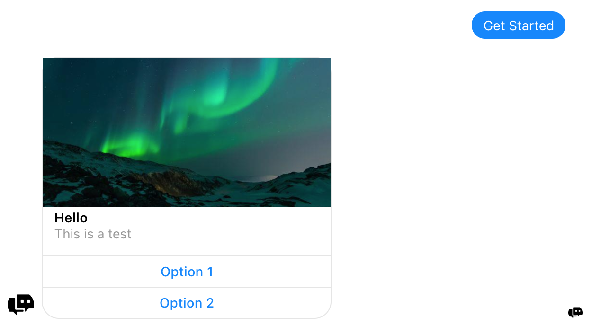

# Messenger Assistant for Facebook Messenger Platform

## What is it?

Messenger Assistant is a network of Facebook chat bots.
* More than just one bot
* Application handles routing and processing of messages for any number of pages linked to the application


Pages linked get their own chat bot each with fully customizable replies. 
* Chat bots are capable of natural language processing, intent and entity extraction, and managing states and context of a conversation
* Bots have the ability to provide instruction for structuring any combination of templates available on the messenger platform


Inbox control can be handed back over to the page owner at any point, manually or at the request of a sender.
* Message notifications are suppressed unless control is handed back to the page owner 
* Page owner can resume bot coverage for a sender by marking done in the page inbox section
* Bot control can also be returned at the request of a sender

> In the clip below, you'll notice that notifications only stay after control has been passed to the page owner.
> I'm receiving these notifications because I own the test page that I'm messaging.


----
## How does it work? 

A webhook event is received by the application (user sends a message, clicks a button, requests handover, etc.)

* Production app uses AWS Lambda function registered to the webhook events
```javascript
exports.handler = (event, context, callback) => {
    // ...
}

// function is invoked everytime a webhook event occurs
```
* Test app (shown in the screencasts) uses a local express server 
> Test Bot 3 shown for the handover demo is actually using the Lambda function, the rest are on the test environment
```javascript
function listen() {
  app.listen(config.port || config.port, () => console.log(`Webhook listening on port ${config.port}...`));
  // ...
}

// function is called manually when we want to listen for events
listen();
```

Event is routed to its appropriate handler

* Events being listened for include messages, postbacks, standbys (messages when control has been passed to the page owner), and handovers 
* Message contents undergo some validation before proceeding (making sure no media is in the message as this messes with the next step)

Instruction is requested from assigned “agent”

* An API is used for managing NLP
* This API acts as the “bot” of the program; intent(s) of the message get extracted, and instructions are sent back to the program accordingly
* Each page inbox a message originated from has its own “agent” responsible for providing instruction on how to proceed with responding to the message
* Instruction is more than just a text response; instruction is data for putting together a structured response (text and quick replies, buttons, images, templates, etc.)

```xml
<response>
    <generic_template>
        <elements>
            <title>Hello</title>
            <image_url>https://www.w3schools.com/w3css/img_lights.jpg</image_url>
            <subtitle>This is a test</subtitle>
            <buttons>
                <type>postback</type>
                <title>Option 1</title>
                <payload>...</payload>
            </buttons>
            <buttons>
                <type>postback</type>
                <title>Option 2</title>
                <payload>...</payload>
            </buttons>
        </elements>
    </generic_template>
</response>
```

*Instruction which is used for putting together a generic template (shown in the following image)...*



POST Request body is constructed according to instruction

* Instruction is sent in XML because it's easy for the program to parse
* XML data gets converted to JSON and the particular post request required for making, say, a generic template appear in messenger is put together
* Once constructed, request body ends up looking something like this

```json
"generic_template": {
    "message": {
        "attachment": {
            "type": "template",
            "payload": {
                "template_type": "generic",
                "elements": [ {
                    "title":"Hello",
                    "image_url":"https://www.w3schools.com/w3css/img_lights.jpg",
                    "subtitle":"This is a test",
                    "buttons":[ {
                        "type":"postback",
                        "title":"Option 1",
                        "payload":"..."
                    }, {
                        "type":"postback",
                        "title":"Option 2",
                        "payload":"..."      
                    } ]           
                } ]
            }
        }
    }  
}
```

Data is routed to the appropriate function responsible for executing POST request

* Usually posting via the send API but also handover protocol pass_thread_control and take_thread_control
* APIs generally use sender_psid (sender of the message), recipient_id (page inbox that received the message), and stored page authentication tokens (in an untracked .json file) for managed pages to ensure response gets back to the correct location

```javascript
request({
    // POST to display a typing bubble
    "uri": "https://graph.facebook.com/v2.6/me/messages",
    "qs": { "access_token": pageAccessToken },
    "method": "POST",
    "json": typingOnJSON
}, (err, res, body) => {
    if (!err) {
        // POST to send the response message
        request({
            "uri": "https://graph.facebook.com/v2.6/me/messages",
            "qs": { "access_token": pageAccessToken },
            "method": "POST",
            "json": request_body
        }, (err, res, body) => {
            if (!err) {
                console.log("POST body:");
                console.log(request_body);
                console.log("--> Response sent");
            } else { 
                console.error(`--! ERROR: ${err}`);
            }
        });
    } else { 
        console.error(`--! ERROR: ${err}`);
    }
});
```

----
## In action

Each step of the process logged


It might be hard to follow, but what's essentially happening is the application is receiving an event (in this case a postback), and each step of the process is being logged (for the sake of tracking what's going on in the code). The body of the received request gets logged first, followed by a mix of reports from within various methods of the program as well as the contents of other requests. The POST request for the API is underneath where it says "Routing payload to agent". The instruction received from the agent is the big block of text in the middle under "Instruction received:". The outline for the POST request that gets sent back to Facebook via the send API is at the bottom under "POST body:". I recommend taking a screen cap and reading through the log to get a better understanding.

[github-repo](https://github.com/cafitzp1/MessengerAssistant)
