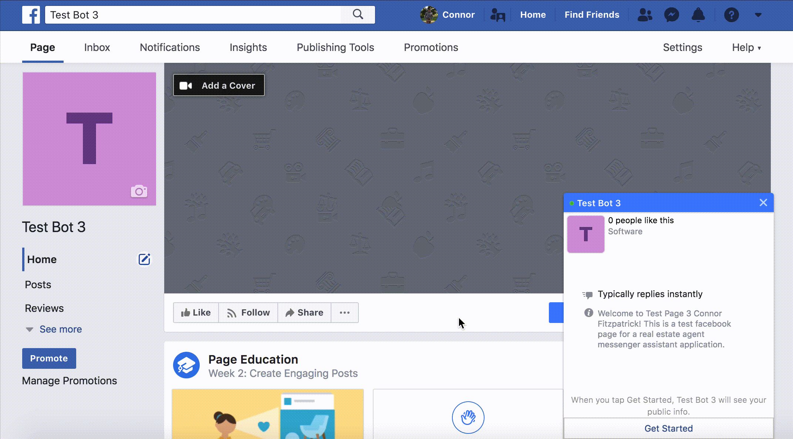

# Messenger Assistant for Facebook Messenger Platform

## What is it?

Messenger Assistant is a network of Facebook chat bots.



Various pages may have their own chat bot each with fully customizable replies. 


Responses can use any combination of the available templates available on the messenger platform. 


Inbox control can be handed back over to the page owner at any point if the message sender requests.


----
## How does it work? 

Webhook event is received by the application (user sends a message or clicks a button)

* Production app uses AWS Lambda function registered to the webhook events
```javascript
exports.handler = (event, context, callback) => {
    // ...
    // function is invoked everytime a webhook event occurs
}
```
* Test app (shown in the screencasts) uses a local express server 
```javascript
function listen() {
  app.listen(config.port || config.port, () => console.log(`Webhook listening on port ${config.port}...`));
  // ...
  // function is called manually when we want to listen for events
}

listen();
```

Event is routed to its appropriate handler

* Most events are messages and are therefore sent to a message event handler
* Message contents undergo some validation before proceeding (making sure no media is in the message as this messes with the next step)

Instruction is requested from assigned “agent” by providing message text

* An API is used for managing NLP
* This API acts as the “bot” of the program; intent(s) of the message get extracted, and instructions are sent back to the program accordingly
* Each page inbox a message originated from has its own “agent” responsible for providing instruction on how to proceed with responding to the message
* Instruction is more than just a text response; instruction is data for putting together a structured response (text and quick replies, buttons, images, templates, etc.)

```xml
<response>
    <generic_template>
        <elements>
            <title>Hello</title>
            <image_url>https://www.w3schools.com/w3css/img_lights.jpg</image_url>
            <subtitle>This is a test</subtitle>
            <buttons>
                <type>postback</type>
                <title>Option 1</title>
                <payload>...</payload>
            </buttons>
            <buttons>
                <type>postback</type>
                <title>Option 2</title>
                <payload>...</payload>
            </buttons>
        </elements>
    </generic_template>
</response>
```

That's the instruction for making this...


POST Request body is constructed according to instruction

* Instruction is sent in XML to make it easy for the program to parse the data
* XML is more or less converted to JSON and the particular post request required for making, say, a button template appear in messenger is put together
* Once constructed, the request_body ends for the example above ends up looking something like this

```json
"generic_template": {
    "message": {
        "attachment": {
            "type": "template",
            "payload": {
                "template_type": "generic",
                "elements": [ {
                    "title":"Hello",
                    "image_url":"https://www.w3schools.com/w3css/img_lights.jpg",
                    "subtitle":"This is a test",
                    "buttons":[ {
                        "type":"postback",
                        "title":"Option 1",
                        "payload":"..."
                    }, {
                        "type":"postback",
                        "title":"Option 2",
                        "payload":"..."      
                    } ]           
                } ]
            }
        }
    }  
}
```

Data is routed to the appropriate function responsible for executing POST request

* Usually posting via the send API but also handover protocol pass_thread_control and take_thread_control
* APIs generally use sender_psid (sender of the message), recipient_id (page inbox that received the message), and stored page authentication tokens for managed pages to ensure response gets back to the correct location

```javascript
request({
    // POST to display a typing bubble
    "uri": "https://graph.facebook.com/v2.6/me/messages",
    "qs": { "access_token": pageAccessToken },
    "method": "POST",
    "json": typingOnJSON
}, (err, res, body) => {
    if (!err) {
        // POST to send the response message
        request({
            "uri": "https://graph.facebook.com/v2.6/me/messages",
            "qs": { "access_token": pageAccessToken },
            "method": "POST",
            "json": request_body
        }, (err, res, body) => {
            if (!err) {
                console.log("POST body:");
                console.log(request_body);
                console.log("--> Response sent");
            } else { 
                console.error(`--! ERROR: ${err}`);
            }
        });
    } else { 
        console.error(`--! ERROR: ${err}`);
    }
});
```

[github-repo](https://github.com/cafitzp1/MessengerAssistant)
